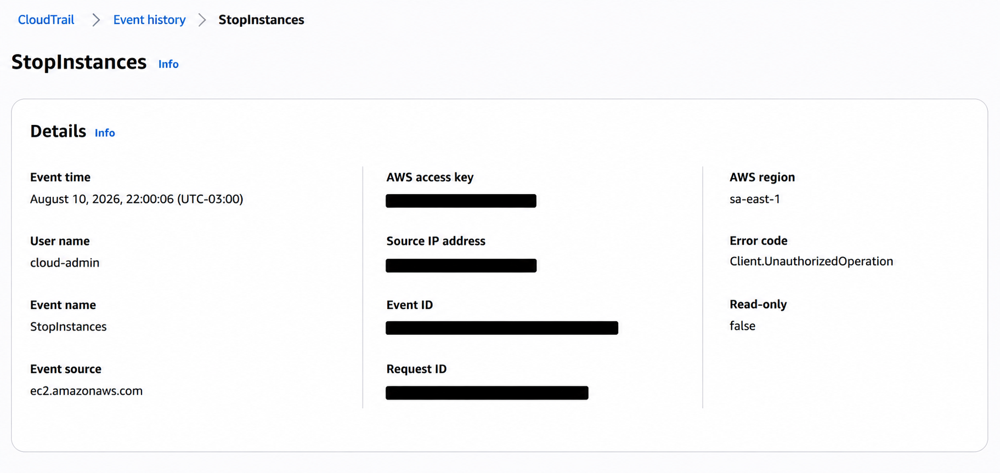

# AWS Cloud Security Infrastructure Lab

Hands-on AWS security lab built manually in the AWS Console to demonstrate secure networking, least-privilege IAM, auditing, monitoring, and cloud troubleshooting.


## Overview

The project implements a small AWS environment with public and private network segmentation, an internet-facing Nginx workload, restricted administrative access, IAM-based S3 access, API auditing, and infrastructure monitoring.

The infrastructure was configured manually to develop a clear understanding of the AWS services before moving to Infrastructure as Code.

## Architecture

- Custom VPC: `10.0.0.0/16`
- Public subnet hosting an Amazon Linux EC2 instance
- Private subnet without direct Internet Gateway routing
- Internet Gateway and public route table
- Nginx exposed through HTTP
- SSH restricted to a single administrator `/32`
- EC2 IAM Role with least-privilege access to a private S3 bucket
- CloudTrail for API auditing
- CloudWatch + SNS for monitoring and alerting

## Security Controls

| Control | Implementation |
|---|---|
| Network segmentation | Separate public and private subnets |
| Administrative access | SSH restricted to administrator `/32` |
| Workload authentication | EC2 IAM Role instead of stored access keys |
| Least privilege | S3 permissions limited to required read operations |
| Data protection | S3 Block Public Access and encrypted EBS volume |
| Auditing | CloudTrail records AWS API activity |
| Monitoring | CloudWatch alarm with SNS email notification |

## Security Validation

The environment was tested with both allowed and denied actions.

| Test | Result |
|---|---|
| HTTP access to Nginx | ✅ Allowed |
| SSH from authorized administrator IP | ✅ Allowed |
| EC2 reads authorized S3 objects | ✅ Allowed |
| EC2 uploads objects to S3 | ✅ Denied |
| EC2 lists all account buckets | ✅ Denied |
| Read-only identity attempts `ec2:StopInstances` | ✅ Denied |
| CloudWatch CPU alarm | ✅ Triggered |
| SNS notification | ✅ Received |

## Incident Investigation

CloudTrail was used to investigate an intentionally denied `ec2:StopInstances` request.

The event provided the identity, AWS Region, API action, timestamp, and authorization result needed to understand what occurred.



## Monitoring

CloudWatch monitored EC2 `CPUUtilization`.

CPU load was intentionally generated to trigger the configured alarm and verify the complete notification path:

```text
EC2 workload
    ↓
CloudWatch Metric
    ↓
CloudWatch Alarm
    ↓
SNS
    ↓
Email Notification

Troubleshooting Highlights
During the lab I diagnosed several real configuration issues:
- AWS Region mismatch: resources appeared missing because the Console was displaying another Region.
- SSH connectivity: access stopped after the administrator public IP changed while the Security Group still allowed the previous /32.
- S3 AccessDenied: verified that denied actions were the expected result of least-privilege IAM rather than a broken configuration.
- Execution context: identified CPU load being generated in local WSL instead of the EC2 instance.


Technologies
AWS: VPC, EC2, S3, IAM, CloudTrail, CloudWatch, SNS, EBS
Systems: Amazon Linux 2023, Nginx, Linux, SSH
Tools: AWS Console, WSL2, Git, GitHub
