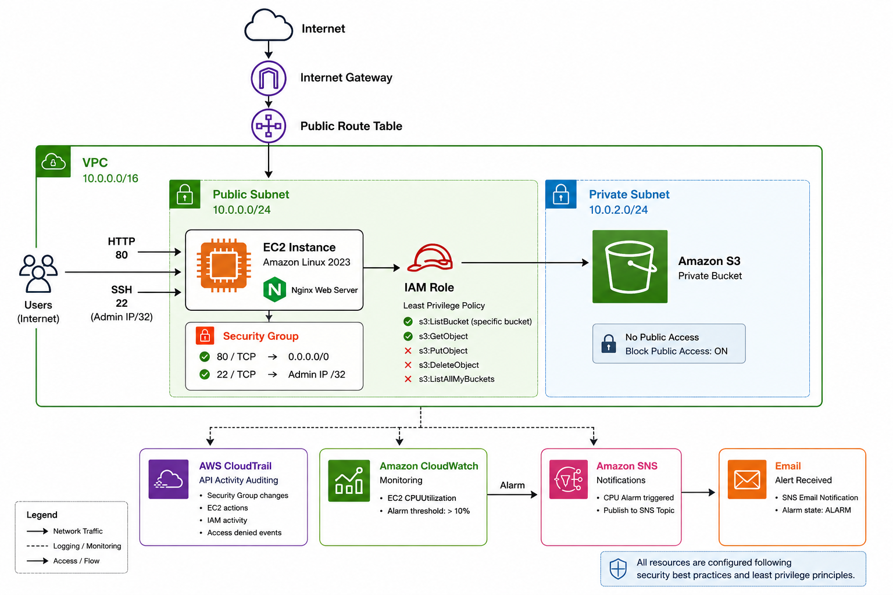

# AWS Infrastructure Lab

Hands-on AWS cloud security lab focused on secure networking, IAM least privilege, monitoring, logging, and alerting.

## Project Overview

This project documents a practical AWS environment built manually to reinforce cloud security fundamentals.

The lab covers:

- Custom VPC creation
- Public and private subnets
- Internet Gateway and Route Tables
- EC2 deployment with Amazon Linux
- SSH access restricted by source IP
- Nginx web server deployment
- Security Groups
- Encrypted EBS storage
- Private S3 bucket
- IAM Roles and custom least-privilege policies
- CloudTrail auditing
- CloudWatch monitoring
- SNS email alerts

## Architecture



The environment was designed with the following structure:

```text
                    Internet
                       |
                       v
                Internet Gateway
                       |
                Public Route Table
                       |
         +-------------+-------------+
         |       VPC 10.0.0.0/16     |
         |                           |
         |  Public Subnet            |
         |  10.0.0.0/24              |
         |       |                   |
         |       v                   |
         |  EC2 Amazon Linux         |
         |  Nginx Web Server         |
         |       |                   |
         |  Security Group           |
         |  80 -> 0.0.0.0/0         |
         |  22 -> Admin IP/32       |
         |       |                   |
         |     IAM Role ------------+----> Private S3 Bucket
         |                           |      Read-Only Access
         |                           |
         |  Private Subnet           |
         |  10.0.2.0/24              |
         +---------------------------+

CloudTrail -> API Activity Auditing
CloudWatch -> CPU Monitoring -> Alarm -> SNS -> Email
```

## Security Controls Implemented

### IAM Least Privilege

The EC2 instance was assigned an IAM Role with only the permissions required to:

- List a specific S3 bucket
- Read objects from that bucket

The instance was intentionally denied permissions such as:

- `s3:PutObject`
- `s3:DeleteObject`
- `s3:ListAllMyBuckets`

This demonstrated the principle of least privilege in practice.

A separate IAM user was also configured with read-only permissions for selected AWS services. An attempt to stop an EC2 instance using this account was denied because the user did not have the `ec2:StopInstances` permission.

### Network Security

The EC2 Security Group was configured with:

- HTTP (`TCP/80`) open to the Internet
- SSH (`TCP/22`) restricted to a single administrator IP using `/32`

This reduces unnecessary exposure of the SSH service while allowing the web server to remain publicly accessible.

### Data Protection

The EC2 root EBS volume was encrypted using the default AWS-managed EBS key.

The S3 bucket was configured as private with public access blocked.

No long-term AWS access keys were stored on the EC2 instance. Access to S3 was provided through an IAM Role using temporary credentials.

## Monitoring and Auditing

### CloudTrail

CloudTrail was used to investigate AWS API activity, including:

- Security Group changes
- EC2 actions
- IAM activity
- Access denied events

One test involved a read-only IAM user attempting to stop an EC2 instance.

The action was denied by IAM and recorded in CloudTrail as an `AccessDenied` event. The event was analyzed to identify:

- User identity
- Event time
- Source IP
- API action
- Result

### CloudWatch and SNS

A CloudWatch Alarm was configured to monitor EC2 `CPUUtilization`.

The alarm triggered when average CPU usage exceeded 10%.

CPU load was intentionally generated on the EC2 instance to test the monitoring pipeline:

```text
EC2 CPU Load
     |
     v
CloudWatch Metric
     |
     v
CloudWatch Alarm
     |
     v
SNS Topic
     |
     v
Email Notification
```

The alarm successfully entered the `ALARM` state and an SNS email notification was received.

## Security Tests Performed

Several controls were intentionally tested to verify that the security policies behaved as expected:

| Test | Expected Result | Result |
|---|---|---|
| SSH from authorized administrator IP | Allowed | Passed |
| HTTP access to Nginx on port 80 | Allowed | Passed |
| EC2 reads authorized S3 object | Allowed | Passed |
| EC2 uploads object to S3 | Denied | Passed |
| EC2 lists all account S3 buckets | Denied | Passed |
| Read-only IAM user views EC2 resources | Allowed | Passed |
| Read-only IAM user stops EC2 instance | Denied | Passed |
| CPU exceeds CloudWatch threshold | SNS alert generated | Passed |

## Troubleshooting Performed

During the lab, several issues were investigated and resolved, including:

- SSH connectivity issues caused by an outdated allowed source IP
- AWS resources appearing missing because the wrong AWS Region was selected
- IAM `AccessDenied` errors caused by intentionally restricted permissions
- S3 access differences between bucket-level and object-level permissions
- Identifying AWS API actions recorded by CloudTrail
- Verifying the difference between local WSL processes and processes running on the EC2 instance

## Key Concepts Reinforced

- Principle of Least Privilege
- AWS Shared Responsibility Model
- IAM Users, Groups, Roles, and Policies
- Temporary credentials
- Security Groups
- CIDR and subnetting
- Public vs. private subnets
- Route Tables
- Internet Gateway
- S3 access control
- EBS encryption
- CloudTrail auditing
- CloudWatch monitoring
- SNS alerting
- Linux SSH and file permissions
- Cloud troubleshooting

## Technologies Used

- AWS VPC
- Amazon EC2
- Amazon S3
- AWS IAM
- AWS CloudTrail
- Amazon CloudWatch
- Amazon SNS
- Amazon Linux
- Nginx
- Linux / SSH
- Git / GitHub

## Next Steps

Future improvements may include:

- Rebuilding the infrastructure using Terraform
- HTTPS/TLS configuration
- AWS Config
- Amazon GuardDuty
- AWS KMS
- AWS Secrets Manager
- Automated security checks
- CI/CD security integration
