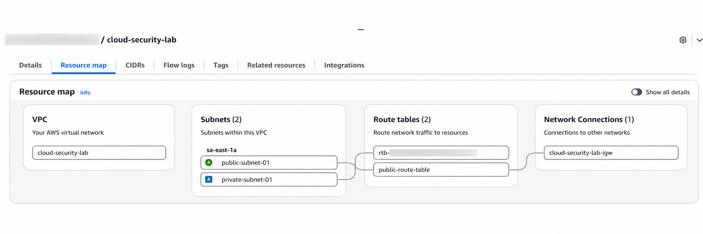

# AWS Cloud Security Infrastructure Lab

Hands-on AWS security project demonstrating secure networking, IAM least privilege, workload authentication, auditing, monitoring, and incident investigation.


## Project Highlights

- Built a custom AWS VPC with public and private network segmentation
- Deployed an Amazon Linux EC2 instance running Nginx
- Restricted SSH access to a single administrator `/32`
- Used an IAM Role instead of long-term AWS credentials on EC2
- Applied least-privilege access to a private S3 bucket
- Tested allowed and denied IAM actions intentionally
- Investigated unauthorized API activity using AWS CloudTrail
- Monitored EC2 CPU utilization using Amazon CloudWatch
- Triggered a real CloudWatch Alarm and SNS email notification
- Troubleshot networking, IAM, SSH, and AWS Region issues

---

## Architecture

The environment was built manually in the AWS Console to reinforce how each infrastructure component works.

```text
                         Internet
                            |
                            v
                     Internet Gateway
                            |
                     Public Route Table
                            |
             +--------------+--------------+
             |        VPC 10.0.0.0/16      |
             |                             |
             |   Public Subnet             |
             |   10.0.0.0/24               |
             |        |                    |
             |        v                    |
             |   EC2 Amazon Linux          |
             |   Nginx Web Server          |
             |        |                    |
             |   Security Group            |
             |   HTTP 80 -> 0.0.0.0/0      |
             |   SSH 22  -> Admin IP/32    |
             |        |                    |
             |      IAM Role --------------+----> Private S3 Bucket
             |                                  Read-Only Access
             |
             |   Private Subnet
             |   10.0.2.0/24
             |
             +----------------------------------+

CloudTrail -> API Auditing
CloudWatch -> CPU Monitoring -> Alarm -> SNS -> Email
```

---

## What This Project Demonstrates

This project demonstrates practical knowledge of:

- AWS network architecture
- Network segmentation
- Identity and Access Management
- Principle of Least Privilege
- Temporary AWS credentials
- Security monitoring
- API auditing
- Authorization troubleshooting
- Linux administration
- Incident investigation fundamentals

---

# Project Showcase

## 1. Network Segmentation



A custom VPC was created with separate public and private subnets.

The public subnet contains the Internet-facing EC2 workload, while the private subnet does not have direct Internet Gateway routing.

### Network configuration

| Resource | Configuration |
|---|---|
| VPC | `10.0.0.0/16` |
| Public Subnet | `10.0.0.0/24` |
| Private Subnet | `10.0.2.0/24` |
| Public Route | `0.0.0.0/0 -> Internet Gateway` |

---

## 2. Network Security

The EC2 Security Group follows different access requirements for public application traffic and administrative access.

| Service | Protocol | Port | Source |
|---|---|---:|---|
| HTTP | TCP | 80 | `0.0.0.0/0` |
| SSH | TCP | 22 | Administrator `/32` |

HTTP is intentionally public because the Nginx server is designed to serve Internet clients.

SSH is restricted because exposing an administrative interface to the entire Internet would unnecessarily increase the attack surface.

---

## 3. IAM Least Privilege

The EC2 instance accesses S3 through an IAM Role.

No long-term AWS access keys were stored on the server.

The role allows only:

```text
s3:ListBucket
s3:GetObject
```

for the required S3 resources.

The following actions were intentionally not granted:

```text
s3:PutObject
s3:DeleteObject
s3:ListAllMyBuckets
```

This allowed the workload to perform its required function without receiving unnecessary permissions.

---

## 4. Authorization Testing

Least privilege was validated through intentional security tests.

A read-only IAM user was allowed to view EC2 resources but was not granted:

```text
ec2:StopInstances
```

When the user attempted to stop the instance, AWS returned:

```text
AccessDenied
```

The EC2 instance remained running.

This confirmed that the authorization policy behaved as expected.

---

## 5. CloudTrail Investigation

The denied `StopInstances` request was investigated using AWS CloudTrail.

The event provided information such as:

- User identity
- Event timestamp
- Source IP address
- AWS Region
- API action
- User agent
- Request parameters
- Authorization result

This demonstrated the difference between:

```text
IAM
-> decides whether an action is allowed

CloudTrail
-> records activity for auditing and investigation
```

---

## 6. Monitoring and Alerting

Amazon CloudWatch was configured to monitor:

```text
EC2 CPUUtilization
```

A CloudWatch Alarm was configured with a laboratory threshold of:

```text
Average CPUUtilization > 10%
```

CPU load was intentionally generated on the EC2 instance.

```text
EC2 CPU Load
      |
      v
CloudWatch Metric
      |
      v
CloudWatch Alarm
      |
      v
SNS Topic
      |
      v
Email Notification
```

The alarm successfully entered the `ALARM` state and an SNS email notification was received.

---

## Security Decisions

| Decision | Security Reason |
|---|---|
| MFA enabled for the AWS root account | Adds an additional authentication factor |
| Root account not used for daily access | Reduces exposure of the highest-privilege identity |
| SSH restricted to `/32` | Reduces exposure of the administrative interface |
| S3 Block Public Access enabled | Helps prevent unintended public data exposure |
| IAM Role used by EC2 | Avoids storing long-term credentials on the server |
| Least-privilege S3 policy | Limits workload permissions |
| EBS encryption enabled | Protects data at rest |
| Read-only IAM identity | Demonstrates separation of permissions |
| CloudTrail auditing | Provides traceability of AWS API activity |
| CloudWatch monitoring | Provides infrastructure visibility |
| SNS alerting | Provides notification when alarm conditions occur |

---

## Security Tests Performed

| Test | Expected | Result |
|---|---|---|
| SSH from authorized administrator IP | Allowed | ✅ Passed |
| HTTP request to Nginx | Allowed | ✅ Passed |
| EC2 lists authorized S3 bucket | Allowed | ✅ Passed |
| EC2 reads authorized S3 object | Allowed | ✅ Passed |
| EC2 uploads object to S3 | Denied | ✅ Passed |
| EC2 lists every bucket in the account | Denied | ✅ Passed |
| Read-only user views EC2 resources | Allowed | ✅ Passed |
| Read-only user stops EC2 | Denied | ✅ Passed |
| CPU exceeds configured threshold | Alarm | ✅ Passed |
| SNS sends notification | Email received | ✅ Passed |

---

## Troubleshooting

Several real configuration issues occurred during the project.

### AWS Region mismatch

An IAM user appeared unable to view the EC2 instance.

The IAM policy was initially investigated, but the actual problem was that the AWS Console was displaying another Region.

**Lesson:** Many AWS resources are regional, so Region should be checked early during troubleshooting.

### SSH connectivity

SSH stopped responding even though the EC2 instance was running.

The Security Group allowed SSH only from a specific `/32`, while the administrator's public IP had changed.

The rule was updated to the current administrator IP.

**Lesson:** Network path and source restrictions should be verified before assuming that the server itself is unavailable.

### S3 AccessDenied

The EC2 instance could access the authorized S3 bucket but could not list every bucket in the account.

This was expected because the IAM Role did not include:

```text
s3:ListAllMyBuckets
```

**Lesson:** `AccessDenied` can indicate that least privilege is working correctly rather than indicating a broken configuration.

### Local vs Cloud CPU testing

CPU load was initially generated inside the local WSL environment rather than inside EC2.

The process location was identified through the shell prompt and corrected by reconnecting to the EC2 instance through SSH.

**Lesson:** Always verify which system a command is executing on during infrastructure troubleshooting.

---

## Technologies Used

### AWS

- Amazon VPC
- Amazon EC2
- Amazon S3
- AWS IAM
- AWS CloudTrail
- Amazon CloudWatch
- Amazon SNS
- Amazon EBS

### Systems and Tools

- Amazon Linux 2023
- Nginx
- Linux
- SSH
- WSL2
- Git
- GitHub

---

## Key Concepts Reinforced

- Principle of Least Privilege
- Defense in Depth
- Network Segmentation
- Public vs. Private Subnets
- CIDR
- Route Tables
- Internet Gateways
- Security Groups
- IAM Users
- IAM Groups
- IAM Roles
- IAM Policies
- Temporary Credentials
- Encryption at Rest
- AWS API Auditing
- Infrastructure Monitoring
- Security Alerting
- Cloud Troubleshooting

---

## Future Improvements

The next versions of this project may include:

- Rebuilding the infrastructure using Terraform
- HTTPS/TLS
- AWS KMS
- AWS Secrets Manager
- Amazon GuardDuty
- AWS Config
- VPC Flow Logs
- CloudTrail log persistence
- Automated security checks
- CI/CD security controls
- Infrastructure deployment through GitHub Actions

---
